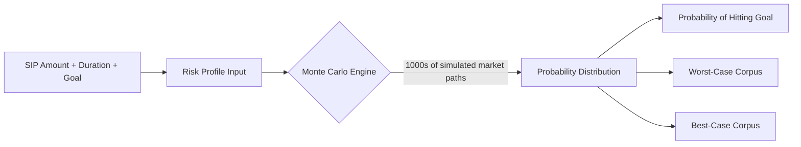
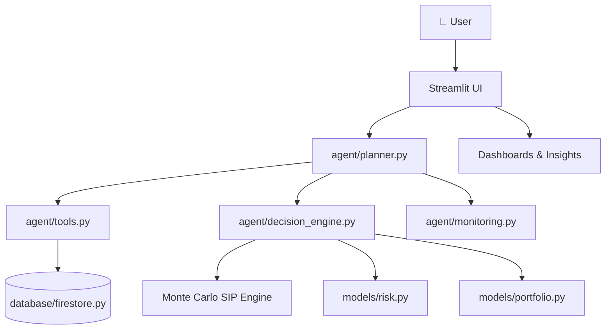

<div align="center">

# 💸 FinPilot — AI Wealth Intelligence Platform

### *Your Money's Autopilot.*

**A fintech-grade, AI-powered Personal Finance Operating System**

[](https://www.python.org/)
[](https://streamlit.io/)
[](#)
[](#-investment-intelligence--sip-monte-carlo-engine-the-heart-of-finpilot)
[](#)
[](#-license)

</div>

---

## About

> **FinPilot is a fintech project** that turns raw bank statements into a full **AI wealth advisor** — but its beating heart is the **SIP Feasibility & Monte Carlo Probability Engine**, which simulates thousands of possible market futures to tell you the *real* odds your SIP hits your financial goal.

If you've ever wondered *"will my ₹5,000/month SIP actually get me to ₹50 lakhs in 10 years?"* — FinPilot doesn't guess. It **simulates it thousands of times** and hands you a probability.

---

##  The Core Problem FinPilot Solves

Most personal finance apps stop at "here's a pie chart of your spending." **FinPilot goes further.**

The **primary mission** of this project is to solve a question every retail investor asks and almost nobody can actually answer with data:

> ###  "Given market volatility, what is the real probability that my SIP investment plan will achieve my financial goal?"

FinPilot answers this using a **Monte Carlo Probability Engine** — running thousands of simulated market paths against your SIP contributions, timeline, and risk profile to produce a statistically grounded feasibility score, instead of a static assumed-return calculator like every other SIP calculator on the internet.

Everything else in FinPilot — spending analysis, budgeting, rebalancing — exists to feed clean, accurate data into this core decision engine.

---

##  Table of Contents

- [ Investment Intelligence — SIP + Monte Carlo Engine (The Heart of FinPilot)](#-investment-intelligence--sip-monte-carlo-engine-the-heart-of-finpilot)
- [ Spending Analysis](#-spending-analysis)
- [ Waste Detection Engine](#️-waste-detection-engine)
- [ Smart Budget Creation](#-smart-budget-creation)
- [ Portfolio Tracking](#-portfolio-tracking)
- [ Monthly Rebalancing Engine](#-monthly-rebalancing-engine)
- [ PDF Bank Statement Support](#-pdf-bank-statement-support)
- [ Tech Stack](#️-tech-stack)
- [ Project Architecture](#️-project-architecture)
- [ Vision](#-vision)
- [ Future Roadmap](#️-future-roadmap)
- [ Folder Structure](#-folder-structure)

---

##  Investment Intelligence — SIP + Monte Carlo Engine (The Heart of FinPilot)

This is the **flagship module** of FinPilot — everything else in this repo supports it.

| Capability | What it does |
|---|---|
|  **Risk Profiling** | Classifies you as Conservative / Moderate / Aggressive |
|  **SIP Feasibility Calculator** | Tests whether your monthly SIP can realistically hit your target corpus |
|  **Goal-Based Investment Planning** | Reverse-engineers the SIP amount needed for a specific financial goal |
|  **Monte Carlo Probability Engine** | Runs thousands of randomized market-return simulations to compute the *actual probability* of goal success — not a single optimistic projection |



---

##  Spending Analysis

- Upload bank statement (CSV or PDF)
- Automatic transaction extraction
- Smart expense categorization
- Visual spending breakdown charts

##  Waste Detection Engine

- Identifies overspending in lifestyle categories
- Highlights recurring unnecessary expenses
- Suggests optimization strategies

##  Smart Budget Creation

- AI-based monthly savings target
- Category-based budget recommendations
- Dynamic budget allocation system

##  Portfolio Tracking

- Return simulation
- Risk-return visualization
- Performance analytics dashboard

##  Monthly Rebalancing Engine

- Portfolio drift detection
- Allocation adjustment suggestions
- Automated rebalancing alerts

##  PDF Bank Statement Support

- Text-based extraction
- OCR-ready architecture (upgradeable)
- Transaction parsing engine

---

##  Tech Stack

| Layer | Technology |
|---|---|
|  Frontend | Streamlit |
|  Backend | Python |
|  Data Processing | Pandas, NumPy |
|  Visualization | Plotly |
|  PDF Parsing | pdfplumber |
|  Simulation Engine | Monte Carlo modeling |
|  Deployment Ready | Streamlit Cloud / Render / AWS compatible |

---

##  Project Architecture



---

## 🚀 Vision

FinPilot is designed to evolve into a **full fintech-grade AI financial assistant** — a lightweight combination of:

-  Zerodha Console
-  CRED Insights
-  INDmoney
-  Personal Wealth AI Advisor

---

## 🗺️ Future Roadmap

- [ ] Real-time market data integration (NSE/BSE APIs)
- [ ] Broker API integration for real SIP execution
- [ ] AI expense classifier (ML-based)
- [ ] Financial health score engine
- [ ] Cashflow forecasting model
- [ ] Mobile responsive UI upgrade

---

## 📂 Folder Structure

```bash
finpilot/
│
├── main.py
├── agent/
│   ├── planner.py
│   ├── tools.py
│   ├── decision_engine.py
│   ├── monitoring.py
│
├── database/
│   ├── firestore.py
│
├── models/
│   ├── portfolio.py
│   ├── risk.py
│
└── utils/
```

---

<div align="center">

### 💡 FinPilot doesn't just track your money — it simulates its future.

**Built with Python  + Streamlit  + Monte Carlo 🎲**

</div>
